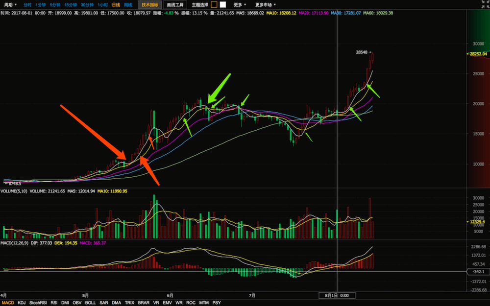
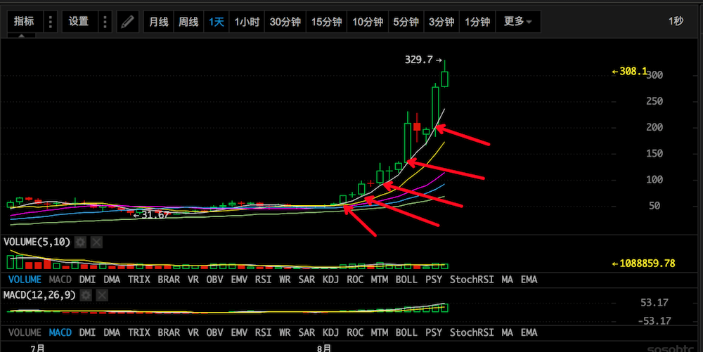
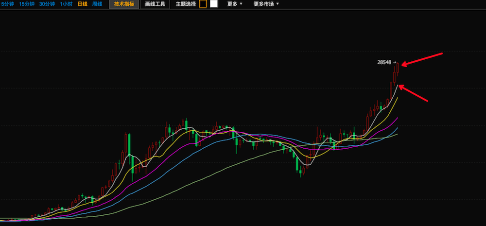

# 狂人笔记
## 买点
开始**上涨**的时候**突破5日线**是买点，
上涨过程中**回踩5日线**是买点
## 卖点
突破5日线，应规避风险
下跌趋势，**反弹至5日线**，应卖出。

### 1.比特币

### 2. 小蚁

日线级别，站上5日线，买入
持续的5日线上涨，每次在5日线均受到强有力的支撑，
要到支撑即开始上涨，上涨过程中，每次回踩均是加仓机会，一旦破位，则表明强势上涨结束。

### 现状

1. 日线级别已偏离5日线较多。
出现这种情况往往会出现向下调整或者横盘震荡等待5日线上移的行为
2. 15日开会，峰会必跌